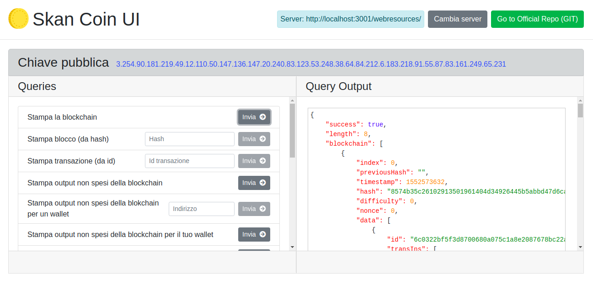
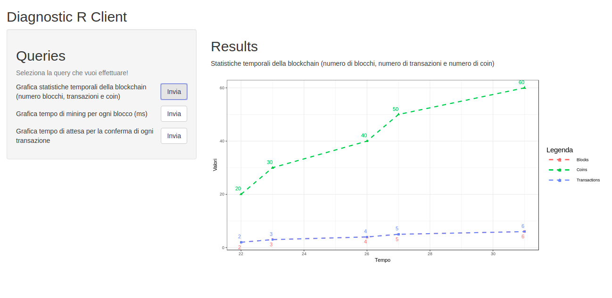

# SkanCoin
A simple criptocurrency written in C++


## Table of Contents
- [References](#References)
- [Screenshots](#screenshots)
- [Requirements](#Requirements)
- [Dependencies](#Dependencies)
- [Running for production](#Running-for-production-with-docker)
- [Running for test](#Running-for-test)
- [Future developments](#Future-developments)


## References
References available (italian only) at:
- doc/Relazione_Scavo_Messina.docx


## Screenshots
- **Web Application**


- **Diagnostic client**



## Requirements
The application has the following requirements (needed to run the project)
Note: this app was successfully tested on Ubuntu 18.04 and ArchLinux. The following links refers to Ubuntu 18.04. If you use a different Operative System, you have to search and download the proper software. Because of C++ App dependencies it's not possible to run this project on Windows or MacOS.
- **C++ Application**:
  1. Cmake (yet installed on Ubuntu 18.04)
  2. Crow library requirements. Open a terminal and write:
		```
		sudo apt-get install build-essential libtcmalloc-minimal4 && sudo ln -s /usr/lib/libtcmalloc_minimal.so.4 /usr/lib/libtcmalloc_minimal.so
		sudo apt-get install libboost-all-dev
		cmake -DOPENSSL_ROOT_DIR=/usr/local/ssl - DOPENSSL_LIBRARIES=/usr/local/ssl/lib
		```
  3. Clang 7.0.1 instead of g++ for Crow library compilation. Open a terminal and write:
		```
		sudo apt update
		sudo apt upgrade
		sudo apt install build-essential xz-utils curl
		curl -SL http://releases.llvm.org/7.0.1/clang+llvm-7.0.1-x86_64-linux-gnu-ubuntu-18.04.tar.xz | tar -xJC .
		mv clang+llvm-7.0.1-x86_64-linux-gnu-ubuntu-18.04 clang_7.0.1
		sudo mv clang_7.0.1 /usr/local
		export PATH=/usr/local/clang_7.0.1/bin:$PATH
		export LD_LIBRARY_PATH=/usr/local/clang_7.0.1/lib:$LD_LIBRARY_PATH
		```

- **Web Application**:
  1. Nodejs and npm. Open a terminal and write:
		```
		sudo apt update
		sudo apt install nodejs
		sudo apt install npm
		```
  2. Http server. Open a terminal and write:
		```
		npm install http-server -o
		```
- **R Application**:
  1. R language. https://www.digitalocean.com/community/tutorials/how-to-install-r-on-ubuntu-18-04-quickstart
  2. R packages: shiny, ggplot2 and jsonlite.  Open a terminal and write:
		```
		sudo -i R
		install.packages("shiny")
		install.packages("ggplot2")
		install.packages("jsonlite")
		```


## Dependencies
The application has the following dependencies (libraries and packages)
- **C++ Application**:
  1. Crow https://github.com/ipkn/crow. Used for HTTP server and P2P server (WebSocket server).
  2. Easywsclient https://github.com/dhbaird/easywsclient. Used for P2P client (WebSocket client).
  3. Rapidjson https://github.com/Tencent/rapidjson. Used to parse json in POST HTTP request of the HTTP server and to parse json in Peer's WebSocket message exchange.
  4. easy-ecc https://github.com/esxgx/easy-ecc. Used for asymmetric encryption.
  5. PicoSHA2 https://github.com/okdshin/PicoSHA2. Used for SHA256 encryption.
- **Web Application**:
  1. AngularJS 1.6.9 https://angularjs.org/.
  2. Bootstrap 4.0.0 https://getbootstrap.com/docs/4.0/getting-started/download/.
  3. FontAwesome 5.6.1 https://fontawesome.com/.
- **R Application**:
  1. Shiny https://shiny.rstudio.com/. Used to create a web application with R.
  2. Ggplot2 https://ggplot2.tidyverse.org/index.html. Used to plot graphs.
  3. Jsonlite https://cran.r-project.org/web/packages/jsonlite/index.html. Used to make HTTP request in R.


## Running for production with Docker
If you don't want to install all requirements and you want to run the system with docker, you can clone this project and run it following the next steps.

>NB: Before you follow this guide you need to have a working installation of **Docker** on your host!

#### 1 - Clone the project from master branch
Open a terminal and write
```
git clone https://github.com/Taletex/SkanCoin.git
```

#### 2 -  Run the project
Open a terminal in the SkanCoin root directory and write
```
sudo docker-compose up
```
>NB: The image building process requires to download heavy docker images, and can take several minutes


## Running for test
After you have installed all requirements you can clone this project and run it following the next steps.

#### 1 - Clone the project from develop branch
Open a terminal and write
```
git clone --branch develop https://github.com/Taletex/SkanCoin.git
```

#### 2 - Build and run the C++ project
Open a terminal in the folder where you have cloned the repository and write
```
cd SkanCoin
mkdir build
cd build
export CXX=/usr/local/clang_7.0.1/bin/clang++
cmake -DDEBUG_FLAG=0 ..
make
./skancoin
```
If you want to enable debug informations on the terminal where the C++ application is running, you can write "-DDEBUG_FLAG=1" instead of "-DDEBUG_FLAG=0". This feature prints on stdout, every time a function is called, the called function name, and the file name and row number where it is placed.

#### 3 - Run the Web Application
Open a new terminal in the folder where you have cloned the repository and write
```
cd WebApp
http-server -o
```
It will open a new browser tab at the address where the web application is running.

#### 4 - Run the Diagnostic Client
Open a new terminal and write
```
sudo -i R
library(shiny)
runApp("/home/taletex/Projects/SkanCoin/DiagnosticClient/app")
```
Note: You need to change the path in the "runApp("")" function according to the path of the folder "app" located inside the "DiagnosticClient" folder.
At the end of the execution of those commands will appear an address where the Diagnostic Client web application is in running. You need to copy and paste this address in a browser page.


## Future developments
- Creating a Join server mechanism to allow peers remember their open connections (alternately, saving connected peers URLs into file and get those URLs when the Peer start in order to ripristinate old connections). This is useful only in case of crash.
- Updating stats files for query2 and query3 also when a node's whole blockchain is replaced.
- Sometimes R app crashes when a query is done because the transaction contains invalid characters.

