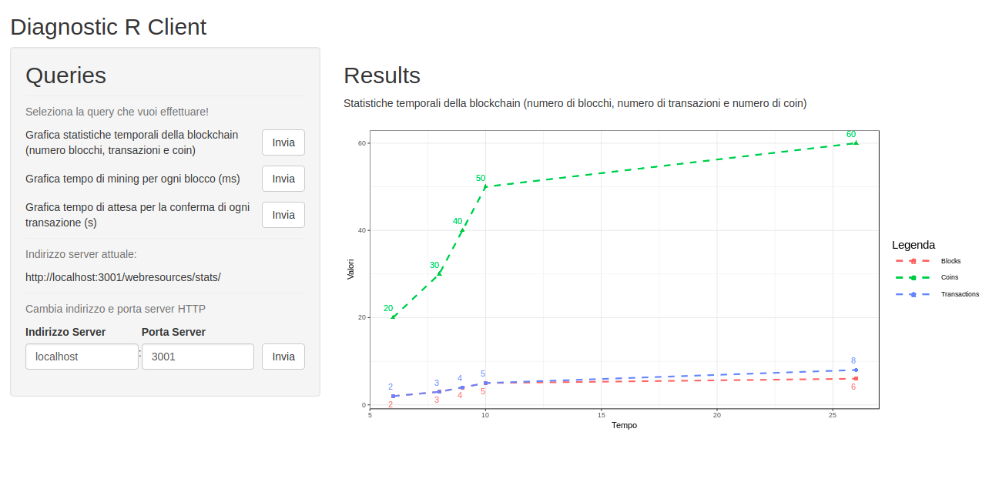

# SkanCoin
A simple criptocurrency written in C++

## Table of Contents

- [References](#references)
- [Screenshots](#screenshots)
- [Requirements](#requirements)
- [Dependencies](#dependencies)
- [Testing](#running-for-test)


## References

References available (italian only) at:
- doc/Relazione_Scavo_Messina.docx


## Screenshots
- Webapp


- Diagnostic client



## Requirements
Note: this app was successfully tested on Ubuntu 18.04 and ArchLinux. The following links refers to Ubuntu 18.04. If you use a different Operative System, you have to search and download the proper software. Because of C++ App dependencies it's not possible to run this project on Windows or MacOS.
- C++ App:
  1. Cmake (yet installed on Ubuntu 18.04)
  2. Crow library requirements. Open a terminal and write:
		```
		sudo apt-get install build-essential libtcmalloc-minimal4 && sudo ln -s /usr/lib/libtcmalloc_minimal.so.4 /usr/lib/libtcmalloc_minimal.so
		sudo apt-get install libboost-all-dev
		cmake -DOPENSSL_ROOT_DIR=/usr/local/ssl - DOPENSSL_LIBRARIES=/usr/local/ssl/lib
		```
  3. Clang 7.0.1 instead of g++ for Crow library compilation. Open a terminal and write:
		```
		sudo apt update
		sudo apt upgrade
		sudo apt install build-essential xz-utils curl
		curl -SL http://releases.llvm.org/7.0.1/clang+llvm-7.0.1-x86_64-linux-gnu-ubuntu-18.04.tar.xz | tar -xJC .
		mv clang+llvm-7.0.1-x86_64-linux-gnu-ubuntu-18.04 clang_7.0.1
		sudo mv clang_7.0.1 /usr/local
		export PATH=/usr/local/clang_7.0.1/bin:$PATH
		export LD_LIBRARY_PATH=/usr/local/clang_7.0.1/lib:$LD_LIBRARY_PATH
		```

- WebApp: none.
- R App:
  1. R language. https://www.digitalocean.com/community/tutorials/how-to-install-r-on-ubuntu-18-04-quickstart
  2. Shiny.  Open a terminal and write:
		```
		sudo -i R
		install.packages("shiny")
		```
  3. ggplot2. Open a terminal and write:
		```
		sudo -i R
		install.packages("ggplot2")
		```
## Dependencies
- C++ App:
- WebApp:
- R App


## Running for Test
You can clone this project and run it following the next steps

#### 1 - Clone the project from develop branch
- Start Command Prompt window.
- On the command line, write
  - ```git clone https://github.com/Taletex/SkanCoin.git ```

#### 2 - Build the project with cmake
- Start Command Prompt window.
- On the command line, write
TODO
